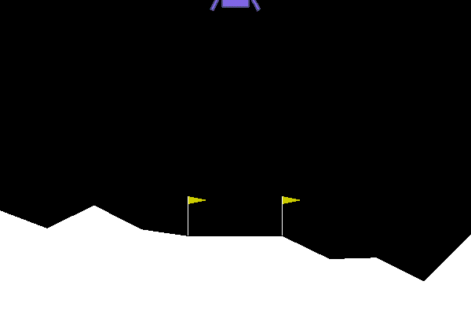

# RL-Gym

## required packages
`pip install stable_baselines3` 
`pip install gym[atari]` 
`git clone https://github.com/rkuo2000/RL-Gym` 
`cd RL-Gym` 

## cartpole 
Gym cartpole sample codes 
* random_action.py
* q_learn.py
* dqn.py
* ddqn.py

`cd cartpole` 
`python random_action.py` 
`python q_learning.py` 
`python dqn.py` 

## sb3
`cd sb3` 

### CartPole, Pendulum, LunarLander
**Train** 
`python train.py CartPole 32000` 
`python train.py Pendulum 32000` 
`python train.py LunarLander 500000` 

**Enjoy** 
`python enjoy.py CartPole` 
`python enjoy.py Pendulum` 
`python enjoy.py LunarLander` 
 
**Enjoy + Gif** 
`python enjoy_gif.py LunarLander` 

### Atari
Env Name listed in Env_Name.txt 

`python train_atari.py Pong 10000000` 
`python enjoy_atari.py Pong` 

## [mario](https://github.com/yuansongFeng/MadMario/)
[Tutorial: Train a Mario-playing RL Agent](https://pytorch.org/tutorials/intermediate/mario_rl_tutorial.html) 
`pip install gym-super-mario-bros` 
`cd mario`

*Training time is around 80 hours on CPU and 20 hours on GPU.* 
To train : (epochs=40000) 
`python main.py`

To replay: ("trained_mario.chkpt") 
`python replay.py`

## stock
`cd stock` 
`python stock_dqn.py GOOGL` 
`python play_stock.py GOOGL` 
